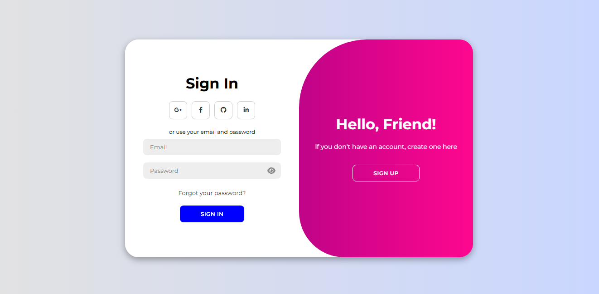
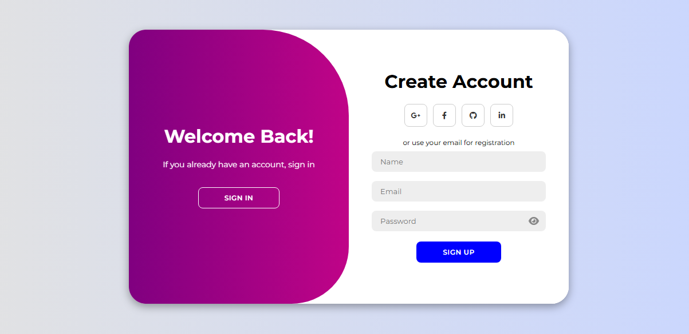

# 🌐 Modern Animated Login & Sign-Up Page

A sleek, responsive login/sign-up form built with **HTML**, **CSS**, and **JavaScript** — complete with:

- Toggleable eye icon for password visibility
- Smooth fade, slide, and bounce transitions
- Fully mobile-responsive layout
- Social login icon placeholders


*Login screen view*


*Sign up screen view*

---

## ✨ Features

- 🔒 **Toggle Password Visibility**  
  Eye icon to show/hide password with smooth animation (bounce + fade).
  
- 🔄 **Switch Between Forms**  
  Toggle from login to registration with fluid sliding panels.

- 💬 **Social Media Icons**  
  Placeholder icons for future integration (Google, Facebook, GitHub, LinkedIn).

- 🎨 **Modern Aesthetic**  
  Beautiful gradients, rounded containers, and smooth hover effects.

- 📱 **Responsive Design**  
  Works seamlessly on mobile, tablet, and desktop.

---

## 🛠 Technologies Used

- **HTML5**  
- **CSS3 (Flexbox + Animations)**  
- **JavaScript (DOM Manipulation)**  
- **Font Awesome (Icons)**  
- **Google Fonts (Montserrat)**

---

## 🚀 Getting Started

### 1. Clone the Repository

```bash
git clone https://github.com/Shem-koome/modern-login-signup.git
cd modern-login-signup
